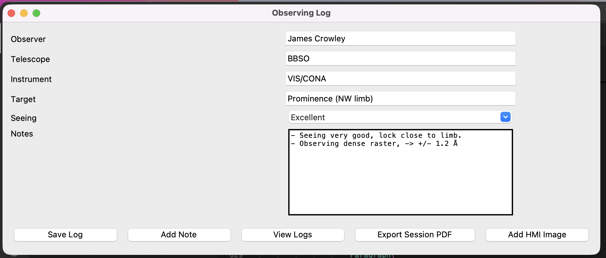

# observing_log
A python code for quickly logging telescope observation details, seeing conditions, and targets.

Saves observing logs as a SQL file, so they can be later searched and modified. Optionally, can export observing report for the day as a PDF.

