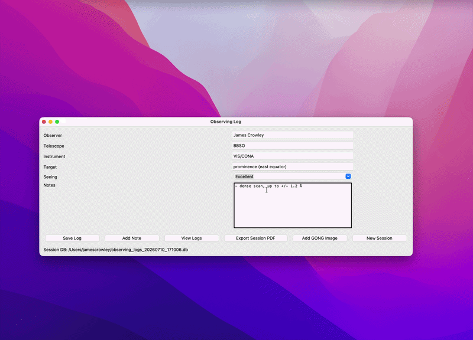

# observing_logger
A python code for quickly logging telescope observation details, seeing conditions, and targets.

Especially designed for Solar observations! At the time of launch, loads the most-recent GONG image so that you can add annotated observation regions directly into your observing log. 

Saves observing logs as a SQL file, so they can be later searched and modified. Optionally, can export observing report for the day as a PDF.

## Features
- Quickly log telescope observation details and save a new entry using the "Add Entry" button.
    - Saves telescope, instrument, and observer details as default entries so you don't have to re-enter them for each observation.
- View and edit past observations stored in the SQL database.
- Export daily observing reports as PDF files.

## To-do:
- Add an observing summary, including statistics like total observing time, at the bottom of the daily report.
- Add an option to refresh the GONG picture.
- Implement a search functionality to quickly find past observations based on various criteria (e.g., date, target, observer).